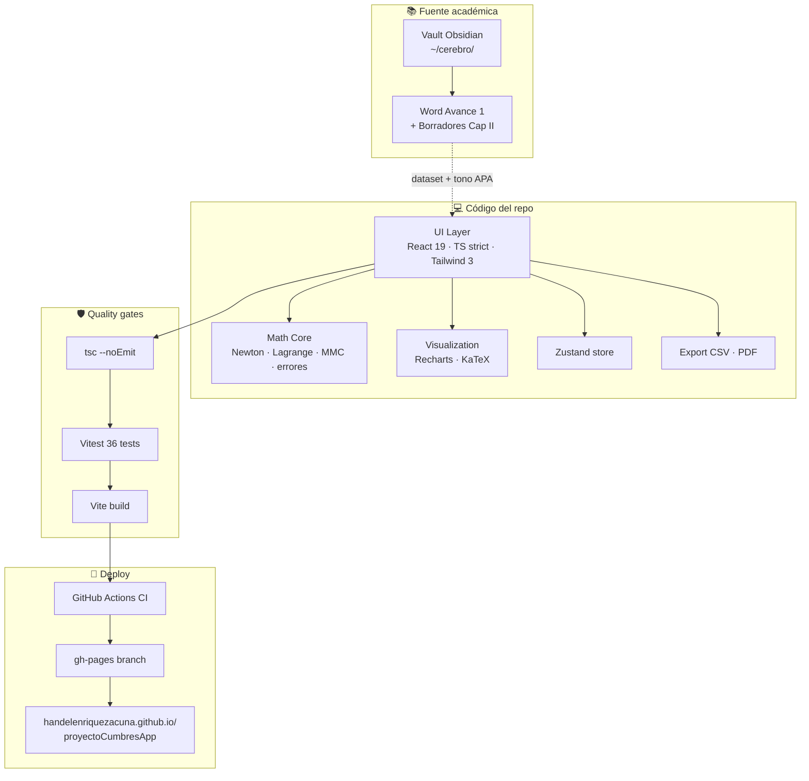
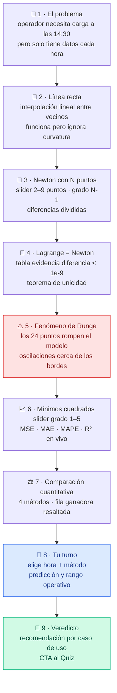
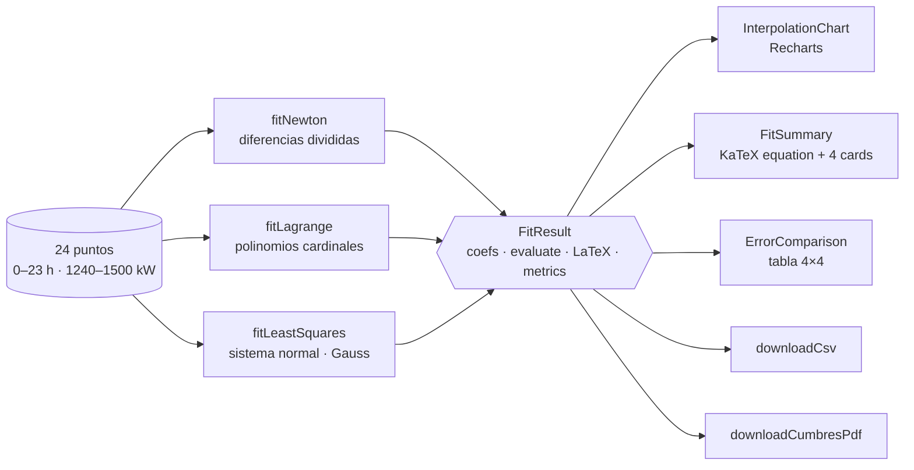

# ⚡ Cumbres — Demand Forecasting

Aplicación web educativa que demuestra interpolación polinómica de Newton, Lagrange y ajuste por
mínimos cuadrados aplicados a la predicción de demanda eléctrica en un centro de datos.

Proyecto académico del curso **MA-108 Métodos Numéricos**, Universidad Fidélitas, Grupo 3
(lunes noche), profesor Edwin Villalobos Martínez. Entrega Avance 2: **2 ago 2026**.

🔗 **URL pública:** https://handelenriquezacuna.github.io/proyectoCumbresApp/

---

## 🗺️ Vista de conjunto



**Cómo leerlo.** El conocimiento académico vive en un vault de Obsidian; el dataset y el tono se
copian al código. La capa UI consume el _math core_ puro de TypeScript, lo visualiza con Recharts
y KaTeX, y exporta CSV/PDF. Cada commit dispara typecheck + tests + build; al pasar, se publica a
GitHub Pages.

---

## 🎬 Recorrido del visitante


Las 7 secciones narrativas reproducen el Capítulo II del Avance 2 (formato APA 7 Fidélitas, citas
verificables). La sección 8 _Pruébalo tú mismo_ es un wizard interactivo que reproduce el
razonamiento completo del proyecto. El Quiz cierra con 5 preguntas de autoevaluación.

---

## 🧭 Los 9 pasos del recorrido guiado



Cada paso es un _card_ con widget interactivo + narración corta + botón siguiente. Progress dots
clickeables permiten saltar.

---

## 🔢 Flujo de datos del math core



Las tres funciones `fit*` devuelven la misma forma `FitResult` (tipo puro definido en
[`src/lib/methods/types.ts`](src/lib/methods/types.ts)), lo que permite que los componentes UI sean
intercambiables sobre cualquier método.

---

## 📦 Stack

| Capa | Tecnología | Por qué |
|---|---|---|
| Build | Vite 5 | build estático trivial para GitHub Pages |
| UI | React 19 + TypeScript 5 strict | tipado fuerte + ecosistema dominante |
| Estilo | Tailwind CSS 3 | mobile-first sin CSS custom |
| Gráficos | Recharts | declarativo, React-nativo |
| Ecuaciones | KaTeX (directo, sin react-katex) | render LaTeX rápido y confiable en React 19 |
| Estado | Zustand | mínimo y sin boilerplate |
| Export | pdfmake + Blob CSV | reporte multi-sección + descarga nativa |
| Tests | Vitest + Testing Library | runner compartido con Vite, 36 tests |
| Deploy | gh-pages + GitHub Actions | gratis, automatizado |

---

## 🗂️ Estructura

```
src/
├── lib/
│   ├── methods/        # newton · lagrange · leastSquares · errors · linalg · types
│   ├── data/           # cumbresDataset (24 puntos canónicos)
│   ├── export/         # csv · pdf
│   └── format.ts       # formatNumber · formatPolynomialLatex · clampX
├── state/store.ts      # Zustand: activeMethod · degree · sampleX · quiz
├── components/
│   ├── layout/         # Header · Footer · TocSidebar · SectionAnchor
│   ├── ui/             # Button · Card · Select · Slider · Tabs
│   ├── math/           # KatexEquation · InlineKatex
│   ├── data/           # DatasetTable · DatasetChart
│   ├── methods/        # MethodPicker · DegreeSlider · InterpolationChart · FitSummary · MethodPlayground
│   ├── compare/        # ErrorComparison
│   ├── quiz/           # Question · QuizResult · Quiz
│   ├── exports/        # CsvDownloadButton · PdfDownloadButton
│   └── walkthrough/    # Walkthrough · MiniChart · helpers
└── sections/           # 01-Hero · 02-Conceptos · 03-Metodos · 04-Aplicaciones
                        # 05-CasoCumbres · 06-Implementacion · 07-Futuro
                        # 08-Conclusiones · 09-Quiz · 10-Walkthrough
tests/                  # unit (math) + components + fixtures
docs/                   # MASTER_PROMPT · ARCHITECTURE · DATASET
.github/workflows/      # ci.yml · deploy.yml
```

---

## ⚡ Comandos

```bash
npm install        # instalar deps
npm run dev        # dev server en http://localhost:5173/proyectoCumbresApp/
npm test           # correr 36 tests
npm run test:coverage  # con cobertura
npm run typecheck  # tsc --noEmit
npm run lint       # eslint
npm run build      # build de producción a ./dist
npm run deploy     # publica ./dist a la rama gh-pages
```

---

## 📚 Documentación

- [`docs/MASTER_PROMPT.md`](docs/MASTER_PROMPT.md) — prompt autocontenido para que un Claude futuro
  recree el proyecto desde cero (15 secciones · stack · dataset · spec del playground · quiz · CI/CD)
- [`docs/ARCHITECTURE.md`](docs/ARCHITECTURE.md) — decisions log con rationale por elección
- [`docs/DATASET.md`](docs/DATASET.md) — origen, calibración y tabla literal del dataset

**Cerebro académico del proyecto:** `~/Documents/fidelitasHan/metodosNumericos/cerebro/`
(vault de Obsidian) — fuente de verdad del tono, citas APA y dataset.

---

## 🤖 Cómo se construyó

Esta app fue construida con **Claude Code** usando un workflow multi-agente orquestado:
14 fases en pipeline con patrón _work + reviewer adversarial_ (math, narrativa, exports), commits
incrementales y deploy automático. Total ~503k tokens y ~36 min de ejecución.

El detalle está en
[`~/cerebro/09-App-Cumbres/Repo-y-Decisiones.md`](../fidelitasHan/metodosNumericos/cerebro/09-App-Cumbres/Repo-y-Decisiones.md)
y en `docs/MASTER_PROMPT.md`.

---

## 👥 Equipo

Grupo 3, MA-108 Métodos Numéricos — II Cuatrimestre 2026:
Handel Enríquez Acuña · Lizzy Castro Duarte · Esteban Rivera Fallas · Ariatna Quirós Rojas ·
Diego Morales Hernández.
