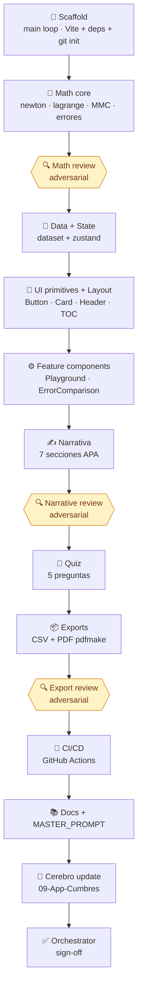

# Architecture — Decisions Log

## Construcción multi-agente

La app fue construida con un workflow orquestado en Claude Code que ejecutó 14 fases en pipeline,
con patrón _work + reviewer adversarial_ en las fases críticas:



Cada fase _work_ escribe los archivos asignados, corre `typecheck + test + build`, y commitea con
prefijo convencional. Las fases _review_ son agentes adversariales que buscan defectos y los
corrigen en sitio. Total: 14 agentes, ~503k tokens.

Hubo un commit de fix adicional posterior al workflow:
[`6aa316c`](https://github.com/handelenriquezacuna/proyectoCumbresApp/commit/6aa316c) reemplazó
`react-katex` por llamadas directas a `katex.render()` para resolver una incompatibilidad con
React 19 que rompía la renderización de `\frac` y `\,`. Y el walkthrough de 9 pasos
([`261a493`](https://github.com/handelenriquezacuna/proyectoCumbresApp/commit/261a493)) se añadió
de forma incremental sobre el resultado del workflow.

## Stack

| Decisión | Alternativa descartada | Por qué |
|---|---|---|
| **Vite + React + TS** | Streamlit + stlite (repo previo) | Stack web moderno, mejor mobile, ecuaciones KaTeX nativas, evolución natural del repo de referencia. |
| **TypeScript strict + noUncheckedIndexedAccess** | TS relajado | Atrapa errores numéricos comunes en arrays de coeficientes y tablas Vandermonde. |
| **Tailwind CSS 3** | CSS Modules / styled-components | Mobile-first sin overhead; no hay diseñador en el equipo. |
| **Zustand** | Redux / Context API | 1 KB, sin boilerplate; estado mínimo (método, grado, sampleX, quiz). |
| **Recharts** | Plotly / Chart.js | Declarativo y React-nativo; suficiente para 24 puntos + curvas. |
| **KaTeX directo (sin react-katex)** | MathJax · react-katex | KaTeX renderiza en cliente sin server-side. Usamos `katex.render()` desde un `useRef + useEffect` porque `react-katex@3.1.0` declara peer `react<20` e introduce un fallo de render en React 19 que rompe `\frac` y `\,`. |
| **pdfmake** | jsPDF | Declarative JSON para tablas/secciones complejas; mejor para reporte multi-sección. |
| **Vitest** | Jest | Comparte config con Vite; arranque instantáneo. |
| **Single-page scroll + hash anchors** | React Router multi-page | Storytelling fluido, una URL pública, mejor SEO/share. |

## Estado

Zustand store mínimo en `src/state/store.ts`:

```ts
{
  activeMethod: Method;
  polynomialDegree: number;     // 1..5
  sampleX: number;              // hora consultada
  quizAnswers: Record<number, number>;
}
```

El resto del estado se mantiene local en componentes (props/useState). No usamos React Context
porque Zustand atraviesa árboles arbitrariamente y es más simple.

## Layout

- **Single page** con secciones identificadas por hash (`#conceptos`, `#metodos`, ...).
- TOC sticky en desktop (`lg:sticky lg:top-24`), colapsa a una sola columna en mobile.
- Cada sección envuelta en `<SectionAnchor id="..." color="cumbres-X">` que aplica
  `scroll-mt-24` para compensar header sticky.
- IntersectionObserver en `useActiveSection` resalta la entrada activa del TOC.

## Runge clamp

Cuando el usuario selecciona Newton o Lagrange sobre los 24 puntos (interpolación equiespaciada
de grado 23), los polinomios oscilan severamente cerca de los extremos (fenómeno de Runge). En
lugar de "arreglar" esto, el chart usa `yDomain={[1100, 1600]}` y la sección 06 Implementación
incluye un banner pedagógico explicando el fenómeno. El "bug" se convierte en feature didáctica.

## Mobile-first

- Todo el layout usa Tailwind responsive (`grid lg:grid-cols-[14rem_minmax(0,1fr)]`).
- Tablas de datos: `overflow-x-auto` para scroll horizontal en mobile.
- Charts: `ResponsiveContainer` de Recharts.
- Probado en 375 px ancho sin scroll horizontal.

## Accesibilidad

- `focus-visible:ring-2` en todos los interactivos.
- `aria-label` en botones icon-only.
- `aria-current="page"` en TOC para sección activa.
- Quiz: roles `radiogroup` / `radio`, navegación con flechas.
- KaTeX renderiza con `aria-hidden="true"` por defecto; texto descriptivo paralelo cuando aplica.

## Bundle size

El bundle es grande (~2.7 MB minificado, ~1 MB gzipped) dominado por pdfmake y sus fuentes.
Trade-off aceptado: PDF download es un requirement, y dynamic-import de pdfmake en próxima
iteración reduciría el initial bundle a < 600 KB. Por ahora prioridad es función sobre tamaño.

## Testing strategy

- **Unit** (`tests/unit/`) cubre `src/lib/methods/*.ts` con fixtures conocidos (cuadrática,
  lineal) más casos adversariales (singularidad, división por cero en MAPE).
- **Component** (`tests/components/`) hace smoke tests con Testing Library.
- **Coverage target:** ≥ 80 % en `src/lib/`. La capa UI no requiere coverage estricto.

## Decisiones que NO se tomaron

- No usamos React Router → no hay rutas separadas.
- No usamos i18n → todo en español.
- No usamos service worker / PWA → app es read-only.
- No usamos analytics → privacidad.
- No usamos auth → contenido público académico.
